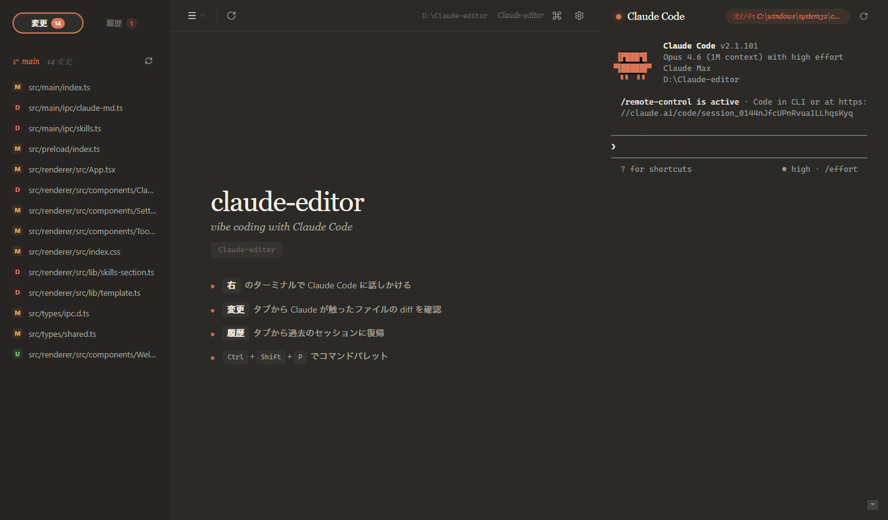

# vibe-editor

[English](README.md) · [日本語](README-ja.md)



> [Claude Code](https://claude.com/code) と [Codex](https://openai.com/codex/) のための軽量デスクトップシェル — **温かく集中できる UI で vibe coding を、さらにマルチエージェントのチーム運用まで標準搭載。**

vibe-editor は一つの思想で設計された Electron アプリです: **コードを書くのはエージェント、人間はレビューして、必要ならエージェントのチームを指揮する。** テキストエディタが主役ではなく、Claude Code / Codex セッションを囲む**レビュー面**と**チーム統率レイヤー**です。

---

## インストール (Windows)

[Releases](https://github.com/yusei531642/vibe-editor/releases/latest) ページから最新の Windows インストーラを落とすのが最速です。

1. `vibe-editor-Setup-1.0.0.exe` をダウンロード
2. 実行。インストーラは **ワンクリックサイレント**（セットアップウィザード無し）で終わり、そのまま vibe-editor が起動します
3. 以降のアップデートは **完全サイレント**。内蔵の自動アップデータが GitHub Releases から新版をバックグラウンド取得し、ダイアログ無しで再起動します

### SmartScreen がブロックした場合

ビルドはコード署名されていません（Authenticode 証明書無し）。お好みで:

- **SmartScreen「詳細情報」→「実行」** — 一番簡単。もしくは `.exe` 右クリック → プロパティ → 下部の「ブロックの解除」にチェック → OK
- **Smart App Control を「評価」モードに** — 設定 → プライバシーとセキュリティ → Windows セキュリティ → アプリとブラウザーの制御 → Smart App Control → **評価**。既知の悪性アプリのみブロック
  - ⚠️「オフ」は選ばないこと。戻すには Windows の再インストールが必要になります。「評価」が落とし所
- **自分でビルド** — `git clone … && npm install && npm run dist:win` で実ファイルを検証

### インストール場所

ワンクリックインストールは `%LOCALAPPDATA%\Programs\vibe-editor\`（ユーザースコープ、管理者権限不要）に入ります。アンインストールは Windows の「インストール済みアプリ」から。設定とチーム履歴は `%APPDATA%\vibe-editor\` に保存され、アンインストール後も残ります。

### macOS / Linux

Pre-built バイナリは未公開です。ソースからビルドしてください:

```bash
git clone https://github.com/yusei531642/vibe-editor.git
cd vibe-editor
npm install
npm run dist        # release/ に出力
```

---

## 必要なもの

- **[Claude Code CLI](https://claude.com/code)** が `PATH` に `claude` として入っていること — 主役。先にインストールして `claude --version` が通ることを確認
- **Git** が `PATH` にあること — 変更ファイル一覧で使用
- **Node.js 20+** — ソースからビルドする場合のみ

Python、C++ ビルドツール、node-gyp は**不要**です（`node-pty` が NAPI prebuilds を同梱）。

---

## 機能

### マルチエージェントチーム（リアルタイムメッセージ配信）

- 2〜30 インスタンスの Claude Code / Codex をロール付きで束ねる（**leader / planner / programmer / researcher / reviewer**）
- Leader はユーザー指示を待ち、メンバーは Leader の委譲を待つ — 勝手に動き出さない
- **pty 直接注入** を使う独自 MCP ハブ (`TeamHub`): Leader が `team_send("programmer", "...")` を呼ぶと、**programmer の入力プロンプトにその場で注入**される。ファイルポーリング無し、キュー無し、遅延無し
- チーム状態の永続化: 作成したチームは `~/.vibe-editor/team-history.json` に保存。**履歴 → Teams** からワンクリックで復元、各メンバーは `claude --resume <session>` で過去の会話をそのまま継続
- 組み込みプリセット（Dev Duo / Full Team / Code Squad）＋カスタムプリセット保存

### ターミナルワークスペース

- 右側に固定の Claude Code / Codex ターミナルパネル（幅はドラッグ調整）
- 最大 30 個のターミナルを同時実行、2/3/4/5 列のグリッドに自動レイアウト
- ペインのドラッグ並び替えで pty を再起動しない
- ターミナル内で `Ctrl+V` → クリップボードの画像を一時ファイルに保存して絶対パスをカーソル位置に挿入（Claude がそのまま読める）
- ロール別カラーラベル、Leader クラウン、チームグループ表示

### ファイルツリー＋軽量エディタ

- 3 タブサイドバー: **ファイル** / **変更** / **履歴**
- 遅延ロード式のファイルツリー（`.git` / `node_modules` / `out` / `dist` などは自動除外）
- ファイルクリック → Monaco ベースのエディタタブで開く（27言語のシンタックスハイライト）
- `Ctrl+S` でアトミック保存（tmp → rename）。TabBar にダーティインジケータ。未保存のまま閉じようとすると確認

### Git 差分レビュー

- `git status --porcelain=v1 -z` 連動の変更ファイルパネル
- クリックで Monaco `DiffEditor` にサイドバイサイド／インラインで差分表示
- 右クリック →「差分レビューを Claude Code に依頼」でアクティブターミナルにプロンプト送信
- バイナリファイルは自動検出してプレースホルダ表示

### セッション履歴

- `~/.claude/projects/<encoded>/*.jsonl` を読み取り、このプロジェクトの Claude Code 過去セッション一覧を表示
- クリックで `claude --resume <id>` の新規タブ起動
- チームセッションは履歴タブの冒頭に Teams セクションとして分離表示

### 自動アップデート

- `electron-updater` が起動時に GitHub Releases をチェック
- 完了時に **サイレント NSIS 上書きインストール** → 自動再起動（ダイアログ無し）
- ダウンロード失敗時のリトライ、GitHub CDN 向けに TLS ハンドシェイクを明示安定化

### テーマとデザイン

- 5 テーマ: `claude-dark`（既定）/ `claude-light` / `dark` / `midnight` / `light`
- 3 段階の情報密度: `compact` / `normal` / `comfortable`
- 日本語タイポグラフィ優先（Notion JP 相当 — Yu Gothic 系スタック、行間 1.75、カーニング）
- レイヤードシャドウ、スプリングアニメーション、アクセント面のノイズオーバーレイ
- アイコンは全て [lucide-react](https://lucide.dev/)

---

## キーボードショートカット

| ショートカット | アクション |
|---|---|
| `Ctrl+Shift+P` | コマンドパレット（全アクションのファジー検索） |
| `Ctrl+,` | 設定 |
| `Ctrl+S` | アクティブなエディタタブを保存 |
| `Ctrl+Tab` / `Ctrl+Shift+Tab` | タブを巡回 |
| `Ctrl+W` | アクティブなタブを閉じる |
| `Ctrl+Shift+T` | 最後に閉じたタブを復活 |

---

## ソースから開発

```bash
git clone https://github.com/yusei531642/vibe-editor.git
cd vibe-editor
npm install
npm run dev
```

Electron が Claude Code ターミナル1つで起動します。左上のプロジェクトメニュー or `Ctrl+Shift+P → フォルダを開く…` で任意のフォルダを開いてください。

### その他のスクリプト

```bash
npm run typecheck    # tsc --noEmit (strict)
npm run build        # electron-vite build → out/
npm run dist:win     # Windows NSIS インストーラ → release/
npm run dist         # 現在の OS 向けインストーラ
npm run icons        # build/icon.svg から ICO / インストーラ BMP を再生成
```

---

## アーキテクチャ

```
src/
├── main/                       # Electron メインプロセス
│   ├── index.ts                # BrowserWindow, IPC 登録, 自動アップデータ起動
│   ├── team-hub.ts             # プロセス内 TCP JSON-RPC MCP ハブ + team-bridge.js 生成器
│   ├── updater.ts              # electron-updater + サイレントインストール
│   └── ipc/
│       ├── app.ts              # getProjectRoot, restart, setupTeamMcp, Claude MCP 登録
│       ├── dialog.ts           # フォルダ/ファイルピッカー
│       ├── files.ts            # ファイルツリー/エディタ用 list/read/write
│       ├── git.ts              # status + diff (HEAD vs worktree)
│       ├── sessions.ts         # ~/.claude/projects/*/*.jsonl 解析 + セッションディレクトリ util
│       ├── settings.ts         # userData/settings.json 永続化
│       ├── team-history.ts     # プロジェクト単位のチーム履歴 JSON ストア
│       └── terminal.ts         # node-pty spawn/write/resize, 画像ペースト, session ウォッチャ
├── preload/
│   └── index.ts                # contextBridge.exposeInMainWorld('api', ...)
└── renderer/src/
    ├── App.tsx                 # レイアウト + 状態管理
    ├── components/
    │   ├── AppMenu.tsx
    │   ├── ChangesPanel.tsx
    │   ├── CommandPalette.tsx
    │   ├── DiffView.tsx
    │   ├── EditorView.tsx
    │   ├── FileTreePanel.tsx
    │   ├── SessionsPanel.tsx
    │   ├── SettingsModal.tsx
    │   ├── Sidebar.tsx
    │   ├── TabBar.tsx
    │   ├── TeamCreateModal.tsx
    │   ├── TerminalView.tsx
    │   ├── Toolbar.tsx
    │   └── WelcomePane.tsx
    └── lib/
        ├── commands.ts         # ファジーフィルタ + Command 型
        ├── i18n.ts             # ja / en フラットキー辞書
        ├── language.ts         # 拡張子 → Monaco 言語
        ├── monaco-setup.ts     # Vite worker wiring
        ├── parse-args.ts       # シェル風 arg split
        ├── settings-context.tsx
        ├── themes.ts           # CSS 変数テーマ
        └── toast-context.tsx
```

### TeamHub の仕組み

```
 ┌──── Electron メインプロセス ────┐
 │                                 │
 │  TeamHub                        │
 │   ├─ 127.0.0.1:rand の JSON-RPC │
 │   ├─ agentId → pty レジストリ   │
 │   └─ team_send → pty.write 注入 │
 │                                 │
 │  terminal.ts が pty を保有       │
 └─────────────────────────────────┘
       ▲                ▲
   stdio MCP        stdio MCP
 ┌────┴────┐      ┌────┴────┐
 │Claude A │      │Claude B │
 │bridge.js│      │bridge.js│ ← ~60 行の TCP パススルー
 └─────────┘      └─────────┘
```

- 起動時に `TeamHub.start()` がランダムポート + 24 バイトトークンで TCP JSON-RPC サーバーを立てる
- `team-bridge.js` を `%APPDATA%\vibe-editor\team-bridge.js` に書き出し、`~/.claude.json` と `~/.codex/config.toml` の `vive-team` MCP として登録
- Claude Code が `vive-team` を spawn するとブリッジが TCP でハブに接続、トークンで認証
- `team_send(to, message)` はハブ側で宛先 `agentId` → pty を引き、`pty.write(message + '\r')` でその場注入。ファイルポーリング無し
- Windows の ConPTY 向けに UTF-8 安全なチャンク送信を実装済み
- アンマウント時にハブ停止、JSON 設定エントリは残す（他のユーザー設定を壊さない）

### 設計上の制約

- メインプロセスが保有: ファイルシステム、git、node-pty、ダイアログ、TeamHub TCP サーバー
- レンダラーは純 UI: `fs` / `child_process` / Node のインポート一切禁止
- すべての IPC は `contextBridge.exposeInMainWorld('api', ...)` 経由
- TypeScript strict モード全コードベース適用

---

## 思想

これはコードエディタではありません。**Claude Code のレビュー面とチームディスパッチャ**です:

- `CLAUDE.md` を人間が編集しない — Claude が書く
- スキルを有効化しない — Claude が説明文から自動ロードする
- 関数を書かない — ターミナルで説明して Claude に書かせる
- 複数の Claude をロール付きで**編成**し、差分をレビューして方向修正する

UI の役目は**邪魔をしないこと**。

---

## ライセンス

MIT — [LICENSE](LICENSE) を参照。

Anthropic、OpenAI との提携関係はありません。「Claude Code」は [Anthropic](https://anthropic.com/) の、「Codex」は [OpenAI](https://openai.com/) のプロダクトです。
