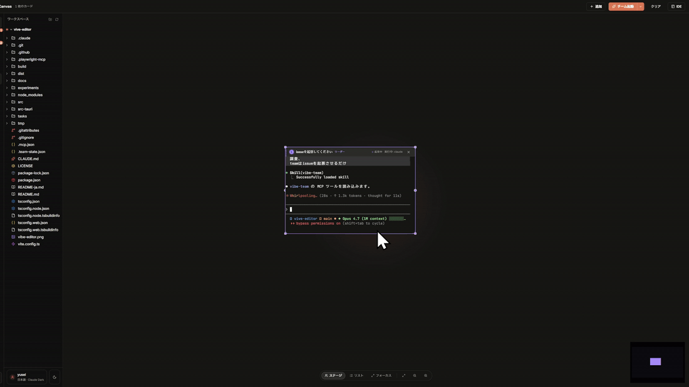

# vibe-editor

[English](README.md) · [日本語](README-ja.md)



> **The team orchestrator for [Claude Code](https://claude.com/code) & [Codex](https://openai.com/codex/).** Spin up 2–30 agents with roles, watch them hand off work in real time, review and redirect from one desktop surface.

vibe-editor is not a code editor. It is a **team dispatcher** built on Tauri + Rust — you describe the job, a leader agent delegates to programmers / researchers / reviewers, messages are **pty-injected directly into each agent's prompt** (no polling, no file queues), and you stay in the loop as reviewer. The built-in editor, git diff, and session history are there to support that review loop, not to compete with your real IDE.


---

## Install (Windows)

The fastest path: grab the latest Windows installer from the [Releases](https://github.com/yusei531642/vibe-editor/releases/latest) page.

1. Download `vibe-editor-Setup-1.0.0.exe`
2. Run it. Install is **one-click silent** — no setup wizard — and auto-launches vibe-editor on finish
3. Future updates are **fully silent**: the built-in auto-updater pulls new releases from GitHub in the background and restarts the app without any dialogs

### If Windows SmartScreen blocks the installer

The build is not code-signed (no Authenticode certificate). Choose whichever you prefer:

- **SmartScreen "More info" → "Run anyway"** — the easiest path. You can also right-click the `.exe` → Properties → tick "Unblock" → OK.
- **Switch Smart App Control to "Evaluation"** — Settings → Privacy & security → Windows Security → App & browser control → Smart App Control → **Evaluation**. Only known-bad apps get blocked.
  - ⚠️ Don't pick "Off" — turning it back on requires a full Windows reinstall. "Evaluation" is the sweet spot.
- **Build locally** — `git clone … && npm install && npm run build` and verify the binary yourself.

### Install location

One-click installs go to `%LOCALAPPDATA%\Programs\vibe-editor\` (user-scope, no admin required). Uninstall via the Windows "Installed apps" list. Settings and team history persist in `%APPDATA%\vibe-editor\` and survive uninstall.

### macOS / Linux

Pre-built binaries are not yet published for macOS and Linux. Build from source:

```bash
git clone https://github.com/yusei531642/vibe-editor.git
cd vibe-editor
npm install
npm run build      # outputs to src-tauri/target/release/bundle/
```

---

## Prerequisites

- **[Claude Code CLI](https://claude.com/code)** on `PATH` as `claude` — the core dependency. Install from the link and make sure `claude --version` works in a terminal.
- **Git** on `PATH` — used by the Changes panel.
- **Node.js 20+** — only if you plan to build from source.

You do *not* need Python, C++ build tools, or node-gyp — the pty layer lives in Rust (`portable-pty`) and the renderer is pure JS. You only need a working Rust toolchain (`rustup`).

---

## Features

### Multi-agent teams with real-time message delivery

- Create a team of 2–30 Claude Code or Codex instances with roles (**leader / planner / programmer / researcher / reviewer**)
- Leader waits for your instruction; members wait for the leader's delegation — nothing auto-starts
- **Direct pty injection** via an in-process MCP hub (`TeamHub`): when a leader calls `team_send("programmer", "...")`, the message is injected **directly into the programmer's input prompt in real time**. No file polling, no message queues, no latency.
- Team state persistence: every team you create is saved to `~/.vibe-editor/team-history.json`. Resume a team from the **History → Teams** sidebar and each member's Claude Code session picks up where it left off via `claude --resume <session>`
- Built-in presets (Dev Duo, Full Team, Code Squad) and custom presets you save yourself

### Terminal workspace

- Fixed Claude Code / Codex terminal panel, drag to resize
- Up to 30 concurrent terminals, auto-arranged in a 2/3/4/5-column grid
- Drag-to-reorder panes without restarting the underlying Claude Code session
- `Ctrl+V` an image in the terminal → saved to a temp file, absolute path inserted at the cursor (ready for Claude to read)
- Per-role colored labels, leader crown, team group rendering

### File tree + lightweight editor

- Three-tab sidebar: **Files** / **Changes** / **History**
- Lazy-loading file tree with a sensible exclude list (`.git`, `node_modules`, `out`, `dist`, ...)
- Click a file → opens in a Monaco-based editor tab with full syntax highlighting
- `Ctrl+S` saves atomically (tmp → rename). Dirty indicator in the tab bar. Confirmation before discarding unsaved edits.

### Git diff review

- Changes panel powered by `git status --porcelain=v1 -z`
- Click a changed file → side-by-side or inline diff in Monaco `DiffEditor`
- Right-click → "Ask Claude Code to review this diff" (sends a prompt to the active terminal)
- Binary files detected and shown as a placeholder instead of garbled text

### Session history

- Browses `~/.claude/projects/<encoded>/*.jsonl` — every past Claude Code session for this project
- Click any entry to spawn a new tab with `claude --resume <id>`
- Team sessions are shown as a separate section at the top of the History tab

### Auto-updater

- Background update checks on startup via `tauri-plugin-updater` against GitHub Releases
- Silent install on completion — no setup wizard, no "Run anyway" prompts on update
- Signed update manifest, resumable downloads, TLS hardened for GitHub CDN

### Theming and polish

- Five themes: `claude-dark` (default) / `claude-light` / `dark` / `midnight` / `light`
- Three density modes: `compact` / `normal` / `comfortable`
- Japanese-first typography (Notion JP style — Yu Gothic stack, 1.75 line-height, kerning)
- Layered shadows, spring animations, noise overlay on accent surfaces
- `lucide-react` icons everywhere

---

## Keyboard shortcuts

| Shortcut | Action |
|---|---|
| `Ctrl+Shift+P` | Command palette (fuzzy search every action) |
| `Ctrl+,` | Settings |
| `Ctrl+S` | Save active editor tab |
| `Ctrl+Tab` / `Ctrl+Shift+Tab` | Cycle tabs |
| `Ctrl+W` | Close active tab |
| `Ctrl+Shift+T` | Reopen last closed tab |

---

## Run from source

```bash
git clone https://github.com/yusei531642/vibe-editor.git
cd vibe-editor
npm install
npm run dev
```

Tauri launches with a single Claude Code terminal tab. Open any folder via the project menu (top left) or `Ctrl+Shift+P` → "Open folder…".

### Other scripts

```bash
npm run typecheck    # tsc --noEmit (strict)
npm run dev:vite     # Renderer only (no Rust)
npm run build        # cargo tauri build → src-tauri/target/release/bundle/
npm run icons        # Regenerate build/icon.ico from build/icon.svg
```

---

## Architecture

```
src-tauri/                       # Rust side (Tauri host)
├── src/
│   ├── main.rs                  # Tauri app entry, updater init
│   ├── lib.rs                   # invoke handler wiring
│   ├── commands/                # IPC handlers (app/git/terminal/settings/…)
│   ├── pty/                     # portable-pty + batcher + Claude session watcher
│   ├── team_hub/                # TCP JSON-RPC MCP hub + embedded team-bridge.js
│   └── mcp_config/              # ~/.claude.json & ~/.codex/config.toml writers
├── Cargo.toml
└── tauri.conf.json

src/renderer/src/                # React 18 + TypeScript, UI only
├── App.tsx
├── components/                  # UI components
├── components/canvas/           # @xyflow/react infinite-canvas mode
├── stores/                      # zustand (ui, canvas)
└── lib/                         # themes, i18n, tauri-api, commands, …
```

### How TeamHub works

```
 ┌────────────── Rust host (src-tauri) ──────────────┐
 │                                                   │
 │  TeamHub                                          │
 │   ├─ TCP JSON-RPC on 127.0.0.1:rand               │
 │   ├─ agentId → pty registry                       │
 │   └─ team_send → pty.write() inject               │
 │                                                   │
 │  commands/terminal.rs owns the ptys (portable-pty)│
 └───────────────────────────────────────────────────┘
          ▲                  ▲
    stdio MCP           stdio MCP
 ┌────┴──────┐      ┌────┴──────┐
 │ Claude A  │      │ Claude B  │
 │ bridge.js │      │ bridge.js │ ← ~60 LOC TCP passthrough
 └───────────┘      └───────────┘
```

- On startup, the Rust `TeamHub` opens a local TCP JSON-RPC server with a random port + 24-byte auth token
- A tiny `team-bridge.js` is written to `%APPDATA%\vibe-editor\team-bridge.js` and registered as the `vibe-team` MCP server in `~/.claude.json` and `~/.codex/config.toml`
- When Claude Code spawns `vibe-team`, the bridge connects to the hub via TCP using the token
- `team_send(to, message)` on the hub resolves the target `agentId` → pty and calls `pty.write(message + '\r')` directly. No file polling.
- UTF-8 safe chunked writes handle long messages on Windows ConPTY
- On app shutdown, the hub stops and MCP config entries are cleaned up (graceful uninstall)

### Constraints

- Rust host owns: filesystem, git, pty, dialogs, the TeamHub TCP server, auto-updater
- Renderer is pure UI: all side effects go through `@tauri-apps/api/core` `invoke()` + `listen()`
- TypeScript strict mode across the whole renderer codebase

---

## Philosophy

This is not a code editor. It is a **review surface and team dispatcher for Claude Code**:

- You do not edit `CLAUDE.md` by hand — Claude does.
- You do not enable skills — Claude auto-loads them by description.
- You do not write functions — you describe what you want in the terminal and Claude writes them.
- You **coordinate** multiple Claudes with roles, review their diffs, and redirect.

The UI's job is to get out of the way.

---

## License

MIT — see [LICENSE](LICENSE).

Not affiliated with Anthropic or OpenAI. "Claude Code" is a product of [Anthropic](https://anthropic.com/); "Codex" is a product of [OpenAI](https://openai.com/).
